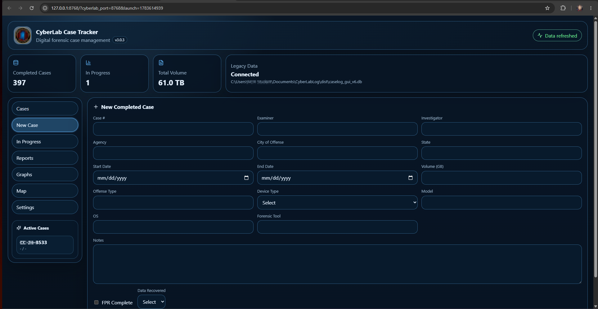

# CyberLab Case Tracker

CyberLab Case Tracker is a digital forensic case log, reporting, mapping, and analytics tool for labs and agencies. The current release introduces a modern browser-based interface while preserving compatibility with the legacy `caselog_gui_v6.db` database and `app_data` folder.

Download the EXE from Releases, place it in a folder on your PC, and create a desktop shortcut if desired. The application stores the database and `app_data` beside the EXE, which keeps deployment friendly for managed PCs that do not allow normal installers.



## Current Release: v3.0.4

- Adds six interface themes: Soft Relief, Spectrum Glass, Electric Azure, Aqua Command, Violet Flow, and Carbon Intelligence.
- Shows every saved dropdown value in Settings and promotes newly used values for immediate editing or deletion.
- Restores all-time PDF reports, graph statistics, and areas-served map output while retaining date-scoped reports.
- Replaces existing report, graph, and map files during export so shared OneDrive folders stay current without accumulating duplicates.
- Adds Windows folder selection for the main and per-report output locations.
- Prevents report generation during ordinary application startup; exports run manually or at the configured schedule time.
- Includes packaged ReportLab dependencies and PDF-generation corrections for the single-EXE build.

## Migration Update

- **Modern browser UI:** The app now launches a local browser interface backed by the packaged CyberLab runtime.
- **No installer required:** The release asset is a single EXE for admin-free deployment.
- **Legacy data compatible:** Existing `caselog_gui_v6.db` and `app_data` can be placed beside the EXE or imported from Settings.
- **Safety backups:** Import and restore workflows create backups before replacing active data.
- **Report continuity:** Native exports support PDF, XLSX, CSV, graph PNG/CSV, map HTML, and map JSON output.
- **Automated reports:** Scheduled exports can run while the app is open.
- **Update checking:** The header can show an update badge when a newer GitHub release is available.
- **Browser preference:** Users can choose system default browser, Chrome, Edge, or auto-detect.

## Updating From an Older Version

1. Back up your current application folder as good practice.
2. Replace the old EXE with the new release EXE.
3. Keep `caselog_gui_v6.db` and `app_data` in the same folder so previous cases, logos, map markers, and settings remain available.
4. Launch the new EXE and confirm the header shows the expected case totals.

## Features

- **Case Entry:** Add completed or in-progress digital forensic cases with examiner, investigator, agency, city, state, offense, device, volume, notes, FPR status, and recovered-data status.
- **Workflow Retention:** Last-used Examiner, Investigator, Agency, City, State, Offense Type, and Device Type persist after saving so repeated sub-case entry is faster.
- **Cases View:** Browse, search, sort, view, edit, duplicate, and delete completed cases.
- **In-Progress View:** Track active cases, edit workflow status, duplicate work items, and complete in-progress cases into the main case log.
- **Map View:** Visualize geocoded case locations with selectable map focus and custom transparent map markers.
- **Graphs:** Preview analytics by offense type, agency, device type, examiner, investigator, city, state, tools, and volume totals.
- **Reports:** Export PDF, XLSX, CSV, graph snapshots, map HTML, and map data files from the modern native export engine.
- **Customization:** Change themes, app header title, report logo, map marker, tab names, tab visibility, field names, field visibility, and custom informational tabs.
- **Custom Fields:** Add user-defined case fields that are stored with each case.
- **Backup & Restore:** Create database backups, restore backups, and generate support bundles from Settings.
- **Legacy Import:** Import a legacy database or zipped `app_data` folder from inside the application.
  


## XLSX Import Format

When importing cases from an Excel file, the following column headers are **required** (case-sensitive):


| Column Header | Description | Format/Type |
|---------------|-------------|-------------|
| `ID` | Unique identifier | Optional, can be empty |
| `Case #` | Case number or identifier | Text |
| `Examiner` | Name of the examiner | Text |
| `Investigator` | Name of the investigator | Text |
| `Agency` | Agency or organization name | Text |
| `City` | City where offense occurred | Text |
| `State` | State where offense occurred | Text |
| `Start (MM-DD-YYYY)` | Case start date | MM-DD-YYYY format |
| `End (MM-DD-YYYY)` | Case end date | MM-DD-YYYY format |
| `Vol (GB)` | Volume size in gigabytes | Numeric |
| `Offense` | Type of offense or crime | Text |
| `Device` | Type of device examined | Text |
| `Model` | Device model | Text |
| `OS` | Operating system | Text |
| `Recovered?` | Data recovery status | Yes/No |
| `FPR?` | Full Physical Recovery status | Yes/No |
| `Notes` | Additional notes or comments | Text |
| `Created (YYYY-MM-DD)` | Creation date | YYYY-MM-DD format |

**Important Notes:**
- All column headers must match exactly (case-sensitive)
- Missing any required column will cause the import to fail
- Date formats must be exactly as specified
- Boolean fields (Recovered?, FPR?) should contain "Yes" or "No"

## Data Storage

- All case data is stored locally in an encrypted SQLite database (`caselog_gui_v6.db`).
- User preferences and settings are stored in the `app_data` directory.
- No data is sent to the cloud or external servers.

## Requirements

- Python 3.8+
- [ttkbootstrap](https://ttkbootstrap.readthedocs.io/)
- [tkintermapview](https://github.com/TomSchimansky/TkinterMapView)
- [matplotlib](https://matplotlib.org/)
- [openpyxl](https://openpyxl.readthedocs.io/)
- [reportlab](https://www.reportlab.com/)
- [geopy](https://geopy.readthedocs.io/)

# Download exe from Releases (no setup) or...

## Install dependencies with:

```
pip install ttkbootstrap tkintermapview matplotlib openpyxl reportlab geopy
```

## Usage

1. Run `CyberLabCaseTracker.py` with Python 3.8+:
   ```
   python CyberLabCaseTracker.py
   ```
2. Use the tabs to add, view, map, and analyze cases.
3. Access settings to customize the app, import data, or change the theme.
4. Use the About tab for version info and support.

## GitHub Safety & .gitignore

- **Do NOT commit user data, database files, logs, or sensitive info.**
- The provided `.gitignore` excludes all user data, database, logs, and cache files.
- Only source code, documentation, and static assets should be pushed to GitHub.

## .gitignore Example

```
# User data and database
caselog_gui_v6.db
app_data/
*.log
*.sqlite*
*.db*
__pycache__/
*.pyc
*.pyo
*.pyd
.DS_Store
.env
*.xlsx
*.pdf
logo.png
marker_icon.png
```

## Support & Documentation

- For help, documentation, or updates, contact your system administrator or the application provider.
- This tool is designed for internal use by digital forensics labs and law enforcement agencies.
- Developer: RF-YVY ([GitHub](https://github.com/RF-YVY))

## License

This project is intended for internal, non-commercial use. See LICENSE file if provided.

<a href="https://www.flaticon.com/free-icons/forensics" title="forensics icons">Forensics icons created by Iconjam - Flaticon</a>
